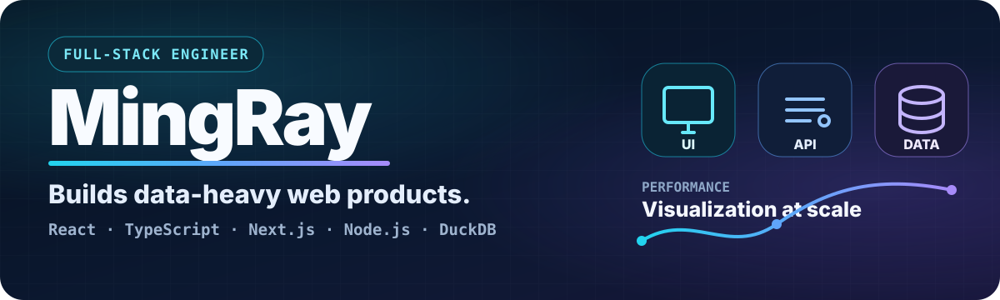
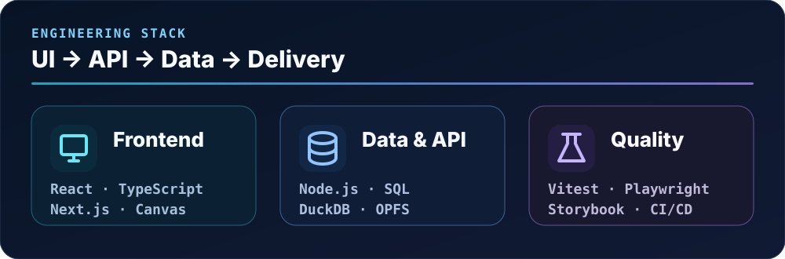
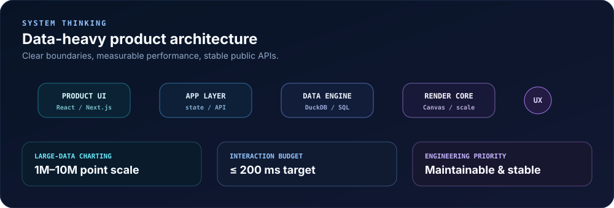

  

  <a href="https://ntustray.github.io/mr-blog/"><strong>Blog</strong></a>
  &nbsp;·&nbsp;
  <a href="https://github.com/ntustRay?tab=repositories"><strong>Projects</strong></a>
  &nbsp;·&nbsp;
  <a href="https://www.npmjs.com/package/@ntustray/react-datetime-range-picker"><strong>npm</strong></a>

## About

I'm **MingRay**, a **Full-Stack Engineer** with deep frontend experience and technical ownership across UI, application architecture, data processing, testing, and delivery.

I build **data-heavy web products and high-performance visualization systems**, with a strong focus on clear module boundaries, measurable performance, backward compatibility, and maintainable APIs.

> 從產品 UI、API 到資料層，我重視的是：**做得出來、跑得穩、之後的人也維護得下去。**

  

## What I work on

- **Full-stack product delivery** — React / TypeScript / Next.js on the product side, Node.js / SQL / DuckDB on the data and API side.
- **High-performance visualization** — Canvas rendering, large datasets, progressive rendering, zoom / pan, and worker-offloaded computation.
- **Library & API design** — reusable TypeScript modules, controlled React APIs, migration awareness, and backward-compatible changes.
- **Quality & delivery** — Vitest, Playwright, Storybook, CI/CD, release validation, and risk-focused code review.
- **Technical ownership** — architecture boundaries, reusable engineering rules, blocker/risk surfacing, and helping teammates move work forward.

  

## Selected work

| Project | What it demonstrates |
| --- | --- |
| [**React DateTime Range Picker**](https://github.com/ntustRay/react-datetime-range-picker) | Published React package with a timestamp-first API, IANA timezone handling, localization, React 18/19 support, CI, E2E and consumer testing. |
| [**Ray Markdown Reader**](https://github.com/ntustRay/markdown-file-reader) | Android Markdown editor built with a web + native stack, local-file workflow, release documentation, and privacy-first product scope. |
| [**MR Blog**](https://github.com/ntustRay/mr-blog) | Astro + TypeScript engineering blog with Markdown content, Pagefind search, Lighthouse checks, and GitHub Pages deployment. |
| [**Agent Workspace Template**](https://github.com/ntustRay/agent-workspace-template) | Vendor-neutral project instructions for Codex, Claude, Cline, opencode, and other coding agents. |

## Engineering principles

**Performance is a budget, not a feeling.** Measure dataset size, device/browser constraints, interaction latency, and before/after behavior.

**Boundaries matter.** Keep rendering, domain logic, state, data processing, and UI integration separate enough to evolve safely.

**Compatibility is a feature.** Public APIs and persisted settings deserve migration thinking rather than casual breaking changes.

**Maintainable beats clever.** Prefer code that a teammate can understand, test, and change with confidence.

---

  
  

  

