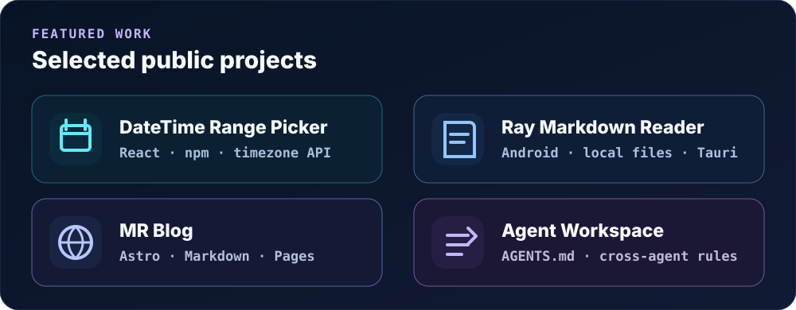

  

  <a href="https://ntustray.github.io/mr-blog/"><strong>Blog</strong></a>
  &nbsp;·&nbsp;
  <a href="https://github.com/ntustRay?tab=repositories"><strong>Projects</strong></a>
  &nbsp;·&nbsp;
  <a href="https://www.npmjs.com/package/@ntustray/react-datetime-range-picker"><strong>npm</strong></a>

## About

I'm **MingRay**, a **Full-Stack Engineer** focused on **data-heavy products**, **high-performance visualization**, and **maintainable systems**.

I work across **UI, API, and data layers** with React, TypeScript, Next.js, Node.js, SQL, and DuckDB.

  

## System thinking

  

## Featured work

  

  <a href="https://github.com/ntustRay/react-datetime-range-picker"><strong>DateTime Picker</strong></a>
  &nbsp;·&nbsp;
  <a href="https://github.com/ntustRay/markdown-file-reader"><strong>Markdown Reader</strong></a>
  &nbsp;·&nbsp;
  <a href="https://github.com/ntustRay/mr-blog"><strong>MR Blog</strong></a>
  &nbsp;·&nbsp;
  <a href="https://github.com/ntustRay/agent-workspace-template"><strong>Agent Workspace</strong></a>

## Engineering focus

- ⚡ **Performance** — Canvas, large datasets, progressive rendering, interaction latency.
- 🧩 **Architecture** — clear boundaries between UI, state, data processing, and rendering.
- 🛡️ **Compatibility** — stable APIs, migration thinking, safer releases.
- 🧪 **Quality** — Vitest, Playwright, Storybook, CI/CD.

  

